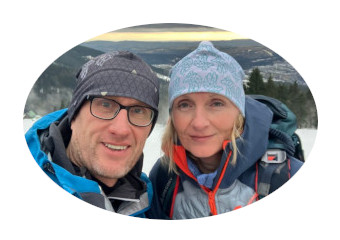

# Nepál 2025

Deník z cesty do Nepálu v roce 2025 pro rodinu a přátele. Z důvodu omezených možností online komunikace v průběhu treku a požadavku na možnost připravovat tento deník offline na telefonu (tablet ani počítač s sebou do hor fakt neponeseme) je deník publikován ve formě markdown souborů na vývojářské platformě github. Deník bude průběžně doplňován a aktualizován offline jak budeme postupovat na naší cestě. Kdykoliv se dostaneme na WiFi proběhne synchronizace na tento web. 

Kromě deníku můžete sledovat náš postup také přes aplikaci Strava kam budu průběžně nahrávat denní pochody z hodinek Garmin Fenix (pro zobrazení detailů aktivit je bohužel nutné se zaregistrovat). Pokud aplikaci Strava nevyužíváte, tak jen kvůli sledování to nedělejte - vše podstatné bude v deníku :-).  

- Deník je dostupný na adrese: https://github.com/hejhalm/nepal-2025/wiki
- Aktivity na Stravě (nutno se zaregistrovat): https://www.strava.com/athletes/24027361

Přejeme příjemné čtení a myslíme na vás!

Jíťa & Mára  

